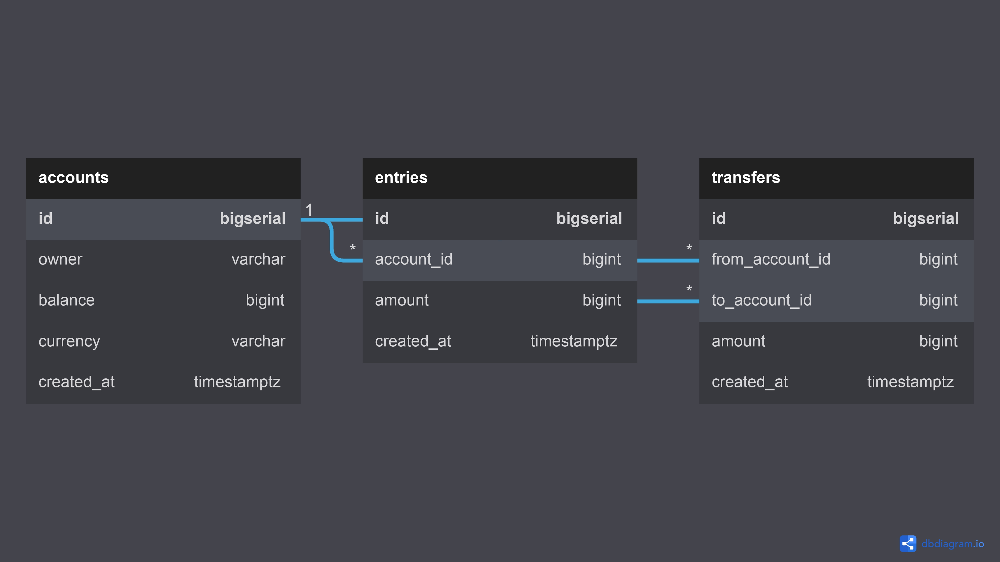

# Description

This is a simple bank application that is built using Golang, Postgresql, and Docker. This application is built based on the [Backend Master Class [Golang + Postgres + Kubernetes + gRPC]](https://www.udemy.com/course/backend-master-class-golang-postgresql-kubernetes/) course.

## Database Diagram

## Dependencies

- Go version 1.18.6 or later
- [Docker](https://www.docker.com/)
- [Postgresql Docker Image](https://hub.docker.com/_/postgres)
- [Golang Migrate](https://github.com/golang-migrate/migrate)
- [SQLC](https://github.com/kyleconroy/sqlc)
- [lib/pq](https://github.com/lib/pq)
- [Gin Gonic](https://github.com/gin-gonic/gin)
- [viper](https://github.com/spf13/viper)

## Learning and Reference Source

- [Backend Master Class [Golang + Postgres + Kubernetes + gRPC]](https://www.udemy.com/course/backend-master-class-golang-postgresql-kubernetes/) by TECH SCHOOL
- [Golang Documentation](https://go.dev/doc/)
- [Docker Documentation](https://docs.docker.com/)
- [Postgresql Documentation](https://www.postgresql.org/docs/current/)
- [Golang Migrate Documentation](https://github.com/golang-migrate/migrate/tree/master/cmd/migrate)
- [SQLC Documentation](https://docs.sqlc.dev/en/latest/)
- [Gin Gonic Documentation](https://gin-gonic.com/docs/)
